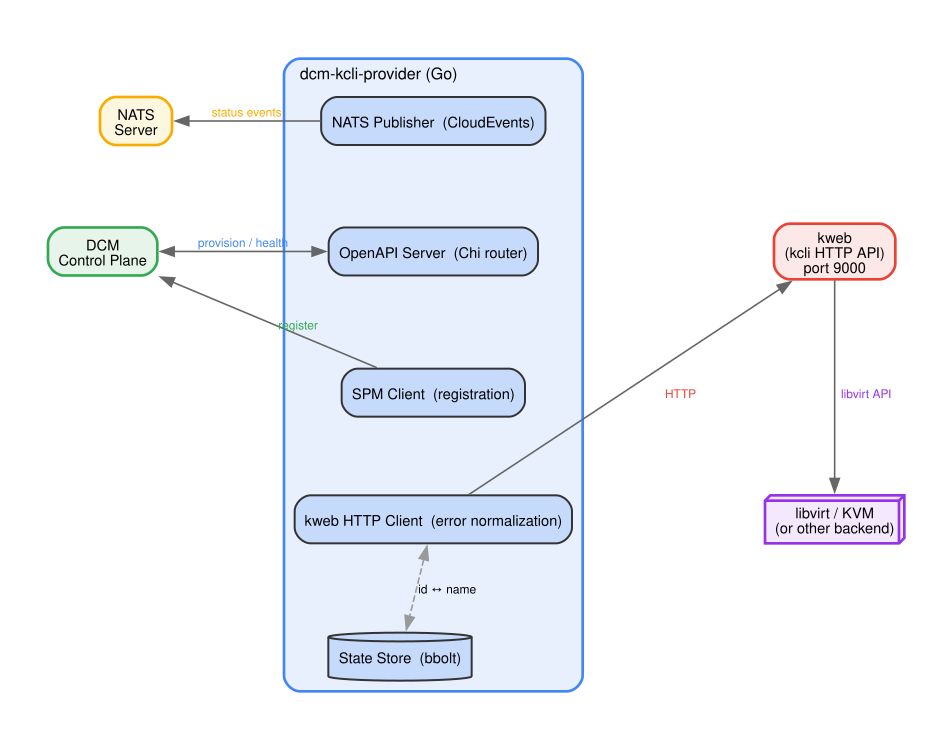

# kcli Service Provider for DCM

A [DCM](https://github.com/dcm-project) Service Provider that manages virtual
machines and Kubernetes clusters through
[kcli](https://github.com/karmab/kcli)'s HTTP API
([kweb](https://kcli.readthedocs.io/en/latest/#web-interface)).

**Designed for development, testing, and homelab environments.** For production
workloads, use the [KubeVirt SP](https://github.com/dcm-project/kubevirt-service-provider)
or [ACM Cluster SP](https://github.com/dcm-project/acm-cluster-service-provider).

## Status

**Enhancement proposal phase.** See
[enhancements/kcli-sp/kcli-sp.md](enhancements/kcli-sp/kcli-sp.md) for the
full design document.

## Overview

This provider registers with the DCM control plane as two separate service
types:

| Registration | Service Type | Description |
|---|---|---|
| `kcli-vm` | `vm` | Create, read, delete VMs on any kcli-supported hypervisor |
| `kcli-cluster` | `cluster` | Create, read, delete Kubernetes clusters (generic, k3s, OpenShift, MicroShift, HyperShift) |

Unlike the existing KubeVirt and ACM providers — which talk directly to
Kubernetes CRDs — this provider communicates with kcli's kweb HTTP API. This
makes it ideal for developers and homelab operators who want to manage VMs and
clusters through DCM without deploying a Kubernetes management stack.

## Architecture



## Development

### Building

```bash
make build
```

### Code Generation

```bash
make generate-api
```

### Releasing

Images will be pushed to `quay.io/dcm-project/dcm-kcli-provider`.
See [Releasing](https://github.com/dcm-project/shared-workflows#release-flow)
in shared-workflows for the full release process, tag behavior, and version
conventions.

## License

Apache License 2.0. See [LICENSE](LICENSE) for details.
